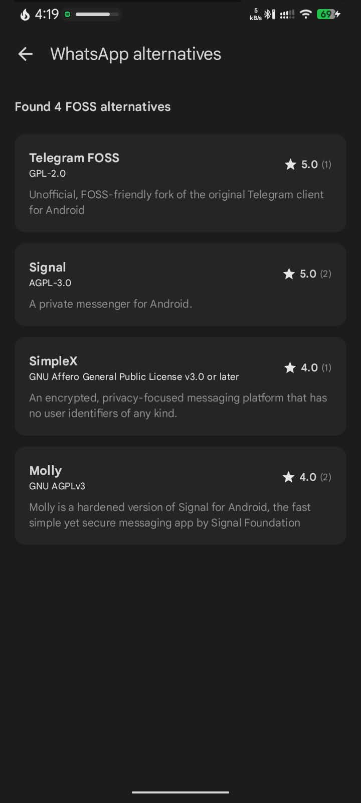
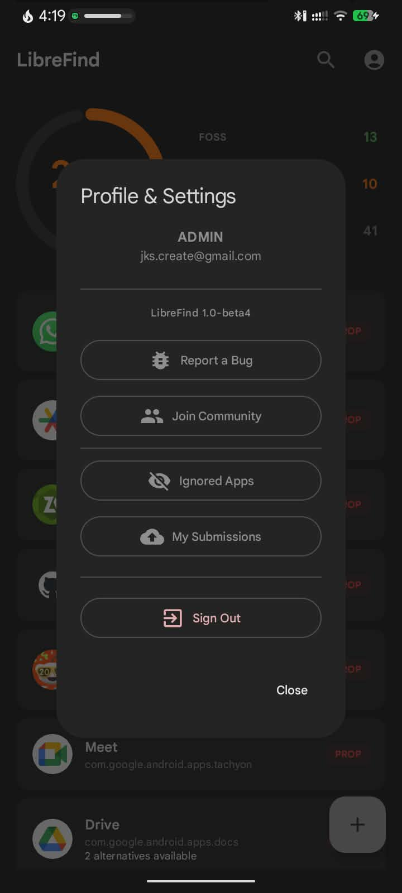

<h1 align="center">
   
    
   
  LibreFind
   
</h1>

<h4 align="center">Discover and replace proprietary apps with FOSS alternatives.</h4>

<h4 align=center>

    
    
  
    

</h4>

 
  
  
   

  

   

## What is LibreFind?

LibreFind is a free and lightweight Android app that scans your device, identifies proprietary
software, and recommends
Free and Open Source Software (FOSS) alternatives. It uses **Supabase** data as its
knowledge
base for proprietary app detection and FOSS alternative recommendations.

### Core Mission

Help users replace proprietary apps with FOSS alternatives.

## Screenshots

| Dashboard                                                          | Alternative List                                                             | Submission                                                           | Profile                                                        |
|--------------------------------------------------------------------|------------------------------------------------------------------------------|----------------------------------------------------------------------|----------------------------------------------------------------|
|  |  |  |  |
| Scan your apps and view sovereignty score                          | Browse FOSS alternatives                                                     | Contribute new alternatives                                          | Track your submissions                                         |

### Community

- Users can propose new FOSS alternatives
- Users can submit PROS/CONS per alternatives
- Admin/Reviewers verify submissions
- Community voting system

## Help Build the LibreFind

The applications database grows entirely through **your contributions**.

### Why contribute?

- **Replace your daily apps** with better FOSS options
- **Your votes shape rankings** for everyone
- **Submit missing alternatives** others need too
- **Every submission makes LibreFind more useful**

  
---

### Required Permissions

- `QUERY_ALL_PACKAGES` - To scan installed apps
    - **Note**: This is a restricted permission.
- `INTERNET` - To query Supabase

Please join the Telegram channel for further discussions.
[Telegram](https://t.me/librefind)

## ☕ Support

LibreFind is a free and open-source project developed by a **student**. While the app is free, the **hosting servers** cost money to keep running 24/7.

If you find this tool useful for reclaiming your digital privacy, please consider buying me a coffee. Your support goes directly toward:
* Paying monthly server bills.
* Keeping the database online and fast.
* Fueling late-night coding sessions

  

## Translations

LibreFind uses [Weblate](https://hosted.weblate.org/engage/librefind/) to manage translations. You can help translate LibreFind into your language!

## Star History

## License

This project is licensed under the **MIT License** - see the [LICENSE](LICENSE)
file for details.

