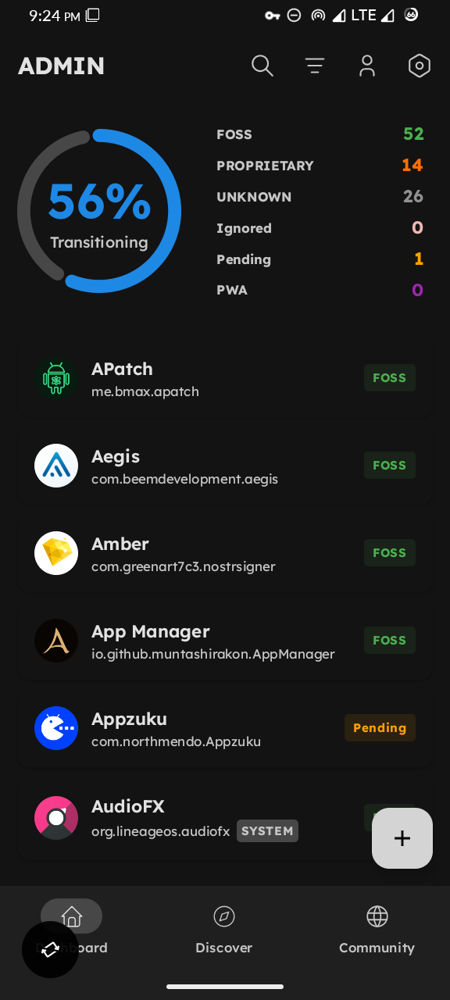
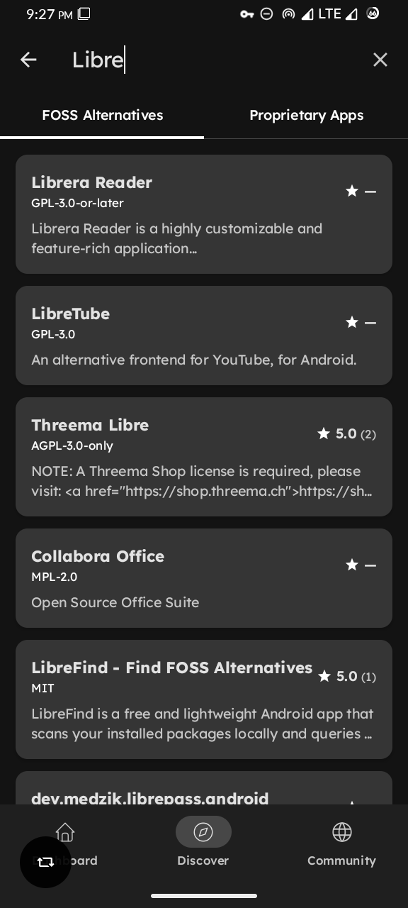
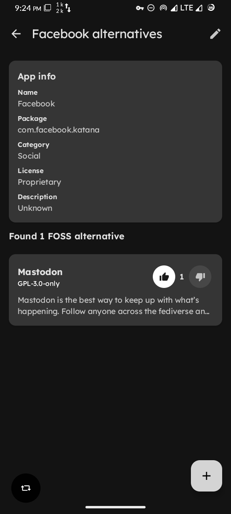
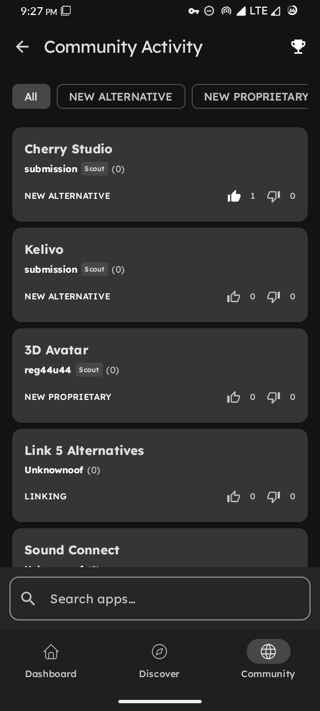
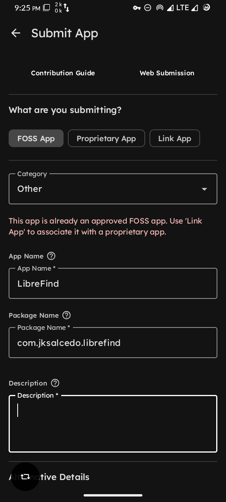
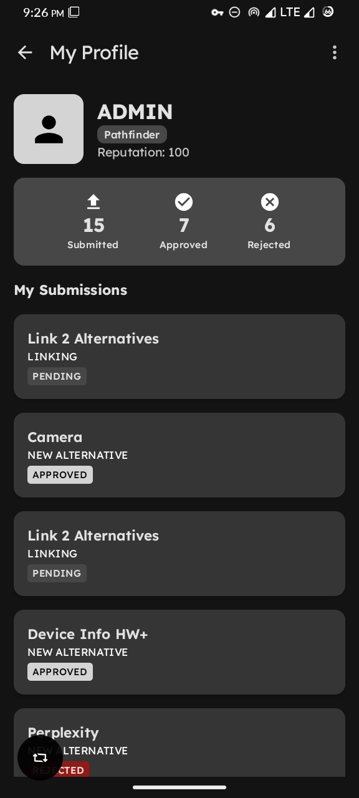

<h1 align="center">
   
    
   
  LibreFind
   
</h1>

<h4 align="center">Discover and replace proprietary apps with FOSS alternatives.</h4>

<h4 align=center>
  
  
  
  
  
  
  
</h4>

  

   

  

   

> [!IMPORTANT]
> **Google has announced that, starting in 2026/2027, all apps on certified Android devices
> will require the developer to submit personal identity details directly to Google.
> Since the developers of this app do not agree to this requirement, this app will no longer
> work on certified Android devices after that time.**
> https://keepandroidopen.org/

## What is LibreFind?

LibreFind is a free, lightweight, and community-driven Android app designed to help you de-Google
your device. It scans your installed packages locally and queries our open-source database to flag
proprietary software, instantly pairing them with privacy-respecting FOSS alternatives.

### Core Features

* **Local Device Scanner:** Audits your installed apps entirely on-device to calculate your personal
  sovereignty score.
* **Global DB Search (Discover):** Look up any FOSS or proprietary app directly in our crowdsourced
  database to plan your next setup.
* **Alternative Recommendations:** Seamlessly browse community-vetted open-source alternatives
  tailored to replace mainstream big-tech software.
* **The Hub (Community):** View, review, and interact with pending app submissions to help maintain
  the database's integrity.
* **Gamified Progression:** Earn points for your contributions and unlock community rank badges (
  *Scout, Pathfinder, Guide, Curator, Vanguard*) directly on your profile.

---

## Screenshots

|                                      Dashboard                                      |                                     Discover                                      |                                       Alternative List                                        |
|:-----------------------------------------------------------------------------------:|:---------------------------------------------------------------------------------:|:---------------------------------------------------------------------------------------------:|
|  |  |  |
|                         Scan apps & view sovereignty score                          |                             Search the FOSS database                              |                                  Browse curated alternatives                                  |

|                                      Community                                      |                                      Submission                                       |                                     Profile                                     |
|:-----------------------------------------------------------------------------------:|:-------------------------------------------------------------------------------------:|:-------------------------------------------------------------------------------:|
|  |  |  |
|                            Interact with pending entries                            |                                 Propose or link apps                                  |                          Track impact & unlock badges                           |

---

### Community Contributions

* **Discover & Vote:** Help the best alternatives rise to the top by upvoting high-quality
  open-source recommendations.
* **Propose New Pairings:** Suggest new FOSS alternatives for proprietary apps directly from your
  device.
* **Review and Vet:** Submit pros, cons, and detailed feedback for existing alternative profiles.
* **Moderate Pending Queue:** Use the Community tab to peer-review pending entries before they go
  live globally.

You can contribute directly within the Android client, or head over to the web version
at [librefind-submission.web.app](https://librefind-submission.web.app/).

---

### Required Permissions

* `QUERY_ALL_PACKAGES` – Used strictly to scan your local application list for proprietary tracking
  components. *(Restricted Permission)*
* `INTERNET` – Used securely to check app configurations against our decentralized Supabase
  database.

### 💬 Join the Community

Connect with fellow open-source advocates, discuss alternative apps, and help shape the project
roadmap:

* [Reddit Subreddit](https://www.reddit.com/r/LibreFind)
* [Telegram Channel](https://t.me/librefind)

---

## ☕ Support

LibreFind is a free and open-source project managed independently. Our goal is to promote digital
privacy by making FOSS apps mainstream. Currently, LibreFind is trusted by **1,735 registered users
** globally.

While the app is free, **infrastructure and hosting servers** cost money to keep running 24/7. If
you find this tool useful for reclaiming your digital privacy, please consider supporting the
project. Your contributions go directly toward:

* Paying monthly server bills.
* Keeping the database fast, responsive, and online.
* Development of heavy features (like offline sync architecture).

  

---

## Contributing

Can't donate? You can still make a massive difference to the project's health:

* **Star the repo** — Helps others discover LibreFind across GitHub.
* **Report bugs** — Open an issue if a scanner module or specific sync crashes.
* **Suggest features** — Share architectural ideas through our issue tracker.
* **Translate** — Bring digital sovereignty to more regions
  via [Weblate](https://hosted.weblate.org/engage/librefind/)
  or [Crowdin](https://crowdin.com/project/librefind).
* **Contribute code** — Fix bugs or help build our client features via Pull Requests.

Every single contribution counts.

---

## 🌍 Translations

LibreFind is a global project. If your native language isn't represented, head to
our [Crowdin Project Page](https://crowdin.com/project/librefind), choose your language, and help
make alternative discovery accessible to everyone.

---

## Star History

## License

This project is licensed under the **MIT License** - see the [LICENSE](LICENSE) file for details.