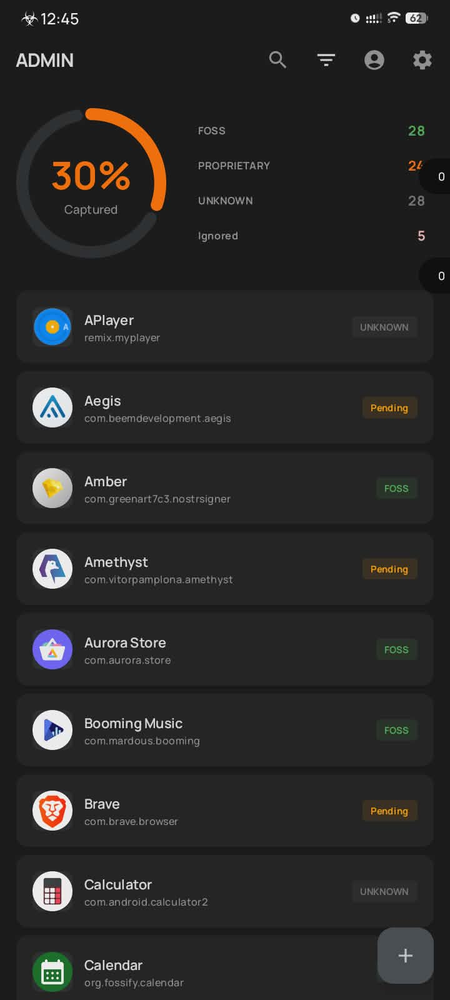
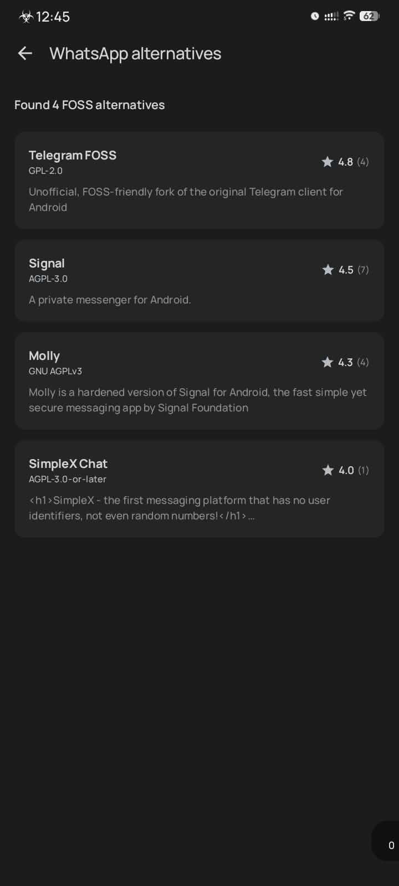
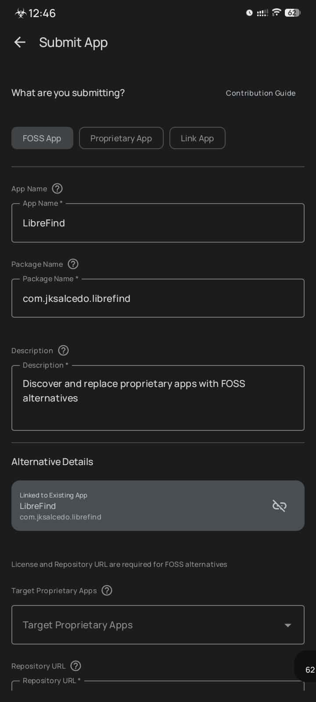
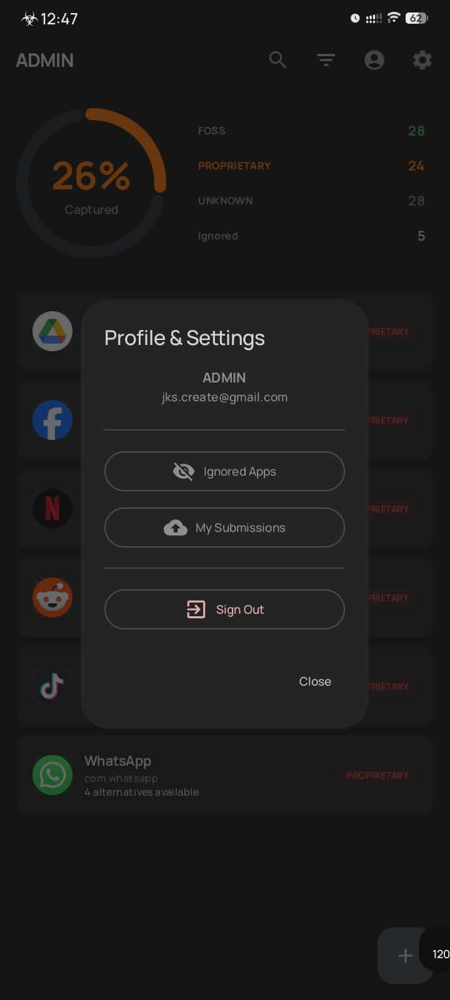

> **Google has announced that, starting in 2026/2027, all apps on certified Android devices
> will require the developer to submit personal identity details directly to Google.
> Since the developers of this app do not agree to this requirement, this app will no longer 
> work on certified Android devices after that time.**
> https://keepandroidopen.org/

<h1 align="center">
   
    
   
  LibreFind
   
</h1>

<h4 align="center">Discover and replace proprietary apps with FOSS alternatives.</h4>

<h4 align=center>
  
  
  
  
  
  
  
</h4>

  

   

  

   

## What is LibreFind?

LibreFind is a free and lightweight Android app that scans your installed packages locally and
queries our database to identify proprietary software and find FOSS alternatives.

### Core Features

- Scan installed apps to detect proprietary software
- Get FOSS alternative recommendations
- View sovereignty scores showing FOSS vs. proprietary ratio
- Community-driven database

## Screenshots

| Dashboard                                                                           | Alternative List                                                                              | Submission                                                                            | Profile                                                                         |
|-------------------------------------------------------------------------------------|-----------------------------------------------------------------------------------------------|---------------------------------------------------------------------------------------|---------------------------------------------------------------------------------|
|  |  |  |  |
| Scan your apps and view sovereignty score                                           | Browse FOSS alternatives                                                                      | Contribute new alternatives                                                           | Track your submissions                                                          |

### Community Contributions

- Propose new FOSS alternatives for review
- Submit pros and cons for existing alternatives
- Vote on app recommendations
- Help build a comprehensive alternative database

You can contribute from within the app, or you can go to [librefind-submission.web.app](https://librefind-submission.web.app/) and use the web version.
  
---

### Required Permissions

- `QUERY_ALL_PACKAGES` - To scan installed apps
    - **Note**: This is a restricted permission.
- `INTERNET` - To query Supabase

Please join the Telegram channel for further discussions.
[Telegram](https://t.me/librefind)

## ☕ Support

LibreFind is a free and open-source project managed independently. Our goal is to promote digital
privacy by making FOSS apps mainstream. Currently, LibreFind is trusted by **1,334 registered users 
** globally.

While the app is free, **infrastructure and hosting servers** cost money to keep running 24/7.

If you find this tool useful for reclaiming your digital privacy, please consider buying me a
coffee. Your support goes directly toward:

* Paying monthly server bills.
* Keeping the database online and fast.
* Development of new features.

  

## Contributing

Can't donate? You can still make a real difference:

- **Star the repo** — helps others discover LibreFind on GitHub
- **Report bugs** — open an issue if something isn't working
- **Suggest features** — share ideas through GitHub issues
- **Test & give feedback** — usability and performance reports are valuable
- **Translate** — help bring LibreFind to more languages
  via [Weblate](https://hosted.weblate.org/engage/librefind/)
- **Spread the word** — share with friends or on social media
- **Contribute code** — fix bugs or add features via pull requests

Every small contribution helps the project grow.

## 🌍 Translations

LibreFind is a global project, and we aim to make FOSS discovery accessible to everyone. 

**Current Status:** We are currently transitioning our localization workflow. While we plan to move to a **self-hosted Weblate instance** in the near future (generously hosted by [@ren7](https://github.com/ren7uk)), we are using **Crowdin** for all active translations in the interim.

### How to contribute:
1. Visit our [Crowdin Project Page](https://crowdin.com/project/librefind).
2. Select your language.
3. Start translating! 

*Note: If your language isn't listed, feel free to open an issue or request it directly on Crowdin.*

## Star History

## License

This project is licensed under the **MIT License** - see the [LICENSE](LICENSE)
file for details.
